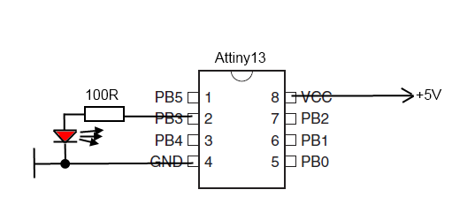

# Set up tools for avr programming

OS: Ubuntu 20.04.2 LTS\
Programmator: ft232rl\
mcu: attiny13a PDIP


For burning mcu's I have ft232rl chip. To make it work inside ubuntu need to do few things below:


## ft232rl Driver installation

1) Download driver (https://ftdichip.com/drivers/d2xx-drivers/)
2) Patch driver

There are a comprehensive instructions in official manual ( AN_220_FTDI_Drivers_Installation_Guide_for_Linux.pdf )

In addition you need to download and install patch:

```
for i in 8 7 6 5 4 3 2 1 0; do wget -O patch-$i.diff http://savannah.nongnu.org/patch/download.php?file_id=1851$i; done
```

```
for file in patch-*.diff; do patch -p0 < $file; done
```

Links:
http://gimmor.blogspot.com/2010/05/ft232rl-linux-ubuntu.html
https://ftdichip.com/drivers/d2xx-drivers/

## Setup programmer in avrdude.conf

Add this

```
programmer
  id    = "ft232r_custom";
  desc  = "FT232R Synchronous BitBang";
  type  = "ftdi_syncbb";
  connection_type = usb;
  miso  = 1;  # RxD
  sck   = 3;  # TxD
  mosi  = 0;  # RTS
  reset = 4;  # DTR
;
```

## Connect MCU to ft232rl


## Prepare to execute avrdude
sudo rmmod ftdi_sio
sudo rmmod usbserial

## Read fuse bits
```
sudo ../avrdude/avrdude-6.3/avrdude -C avrdude.conf -c ft232r_custom -pt13 -P ft0 -b 4800 -U lfuse:r:-:h 
```

Default values are:

lfuse: 0x6a
hfuse: 0xff

Description you can find in documentation. Excerpt from doc:


## Burning MCU
sudo ../../avrdude/avrdude-6.3/avrdude -C avrdude.conf -c ft232r_custom -p t13 -b 4800 -U flash:w:main.hex


# Program MCU
We have following source code:

```
  #include <avr/io.h>
  #include <util/delay.h>

  int main(void)
  {
    DDRB = 1<<3; // port B3, ATtiny13a pin 2
    PORTB = 0x0;

    while (1)
    {
      PORTB = 1<<3; // port B3, ATtiny13a pin 2
      _delay_ms(500);
      PORTB = 0X0;
      _delay_ms(250);
    }
  }
```

Skip comilation part. After compiling we have main.hex. Connect MCU as on image above and run avrdude:


```
sudo ../../avrdude/avrdude-6.3/avrdude -C avrdude.conf -c ft232r_custom -p t13 -b 4800 -U flash:w:main.hex
```


After that you need to connect mcu as on schematic below:




